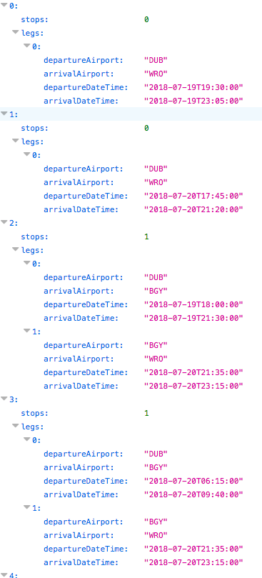

# interconnecting-flights
Ryanair - Task 2 - Java/Spring - Interconnecting Flights

## Overview
This is my implementation of the Interconnecting Flights problem. It has been developed in Java 8, as a Spring Boot application. 
The application can be packaged by Maven as a WAR (mvn clean package) and expected to be deployed on Tomcat (v9.0.10 recommended).

Declarative REST clients (using Feign) have been developed to consume Ryanair microservices API and it provides a simple Spring MVC REST controller to expose the endpoint API required which can be reached at : 

http://localhost:8080/interconnecting-flights/interconnections

## Usage
The interconnections service can be accesed using the following URL pattern : 

http://localhost:8080/interconnecting-flights/interconnections?departure=DEPARTURE_AIRPORT&arrival=ARRIVAL_AIRPORT&departureDateTime=DEPARTURE_DATE&arrivalDateTime=ARRIVAL_DATE

where DEPARTURE_AIRPORT and ARRIVAL_AIPORT uses IATA codes
and date times are expressed in the following format : YYYY-MM-DDTHH:MM:SS

The following URL should provide a JSON list containing the list of flights departing from a given departure airport not earlier
than the specified departure datetime and arriving to a given arrival airport not later than the
specified arrival datetime. The list should consist of:
*- all direct flights if available (for example: DUB - WRO)
*- all interconnected flights with a maximum of one stop if available (for example: DUB - STN - WRO)
*- For interconnected flights the difference between the arrival and the next departure should be 2h or greater

## Example
http://localhost:8080/interconnecting-flights/interconnections?departure=DUB&arrival=WRO&departureDateTime=2018-07-19T16:00&arrivalDateTime=2018-07-20T23:50

The resulting list should be of the following form:

